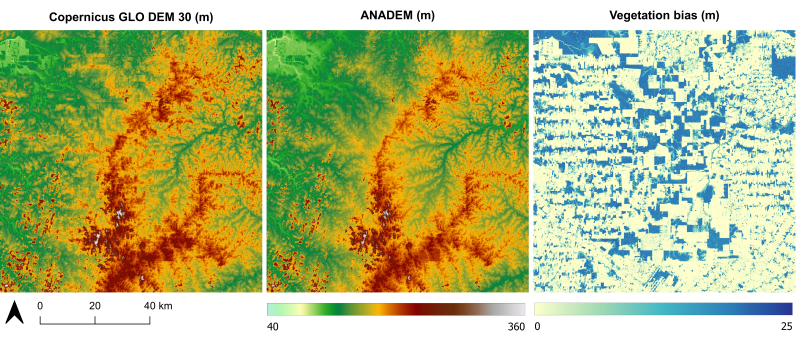

# anadem.github.io

## ANADEM - South America Digital Terrain Model

ANADEM is a digital terrain model (DTM) for South America. The model removes the vegetation bias from the Copernicus GLO-30 DEM by appling a new methodology based on remote sensing data and machine learning.

The data is freely available at 30 meters in Google Earth Engine platform or in TIF files located in the Download section in this page.

<h3>Earth Engine Snippet</h3>

<code tabindex="0">var anadem = ee.ImageCollection("projects/et-brasil/assets/anadem/v1");

ANADEM visualization in Google Earth Engine JavaScript

<pre><code class="language-javascript">
    /*
    Developed by the Federal University of Rio Grande do Sul and Brazilian Water Agency (ANA)
    contact: leonardo.laipelt@ufrgs.br
    */
    
    // Asset
    var anadem = ee.Image('projects/et-brasil/assets/anadem/v1');

    // Remover noData
    var anadem = anadem.updateMask(anadem.neq(-9999));
    
    // Visualization parameters
    var visparams = { min: 0,
    max: 1300.0,
    palette:['006600', '002200', 'fff700', 'ab7634', 'c4d0ff', 'ffffff']
    };
    // add layer 
    Map.addLayer(anadem,visparams,'anadem');
    </code>
</pre>

